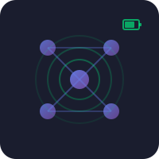
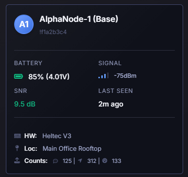

<div align="center">
  
  
  # Meshtastic Node Card for Home Assistant
  
  [](https://github.com/hacs/integration)
  [](https://github.com/T-REX-XP/ha-meshtastic-node-info-custom-card/releases)
  
  A custom card for Home Assistant to display Meshtastic node information with a beautiful, modern UI.
</div>

## Screenshots



*Example of the Meshtastic Node Card displaying node information with battery level, signal strength, and hardware details.*

## Features

- 📱 Node name and ID display with avatar
- 🔋 Battery level with visual indicator
- 📶 Signal strength (RSSI/SNR) with bars
- ⏰ Last seen timestamp
- 🔧 Hardware information
- 📍 Location data
- 💬 Message statistics

## Installation

### HACS Installation (Recommended)

[](https://my.home-assistant.io/redirect/hacs_repository/?owner=T-REX-XP&repository=ha-meshtastic-node-info-custom-card&category=plugin)

**Click the button above** or follow these steps:

1. Open HACS in your Home Assistant instance
2. Click on "Frontend"
3. Click the three dots menu (top right) → Custom repositories
4. Add repository URL: `https://github.com/T-REX-XP/ha-meshtastic-node-info-custom-card`
5. Category: `Lovelace`
6. Click "Add"
7. Find "Meshtastic Node Card" and click "Install"
8. **Important:** Clear your browser cache (Ctrl+Shift+R or Cmd+Shift+R)
9. Restart Home Assistant

**⚠️ Card not appearing?** See [TROUBLESHOOTING.md](TROUBLESHOOTING.md) for detailed help.

#### Post-Installation Checklist

After installing, verify these steps:

- [ ] **Clear browser cache** - Hard refresh with Ctrl+Shift+R (Windows/Linux) or Cmd+Shift+R (Mac)
- [ ] **Restart Home Assistant** - Settings → System → Restart
- [ ] **Check resource is added** - Settings → Dashboards → Resources → Look for `/hacsfiles/ha-meshtastic-node-info-custom-card/meshtastic-node-card.js`
- [ ] **Check browser console** - Press F12, look for errors related to the card
- [ ] **Verify file exists** - Check `/config/www/community/ha-meshtastic-node-info-custom-card/meshtastic-node-card.js`

### Manual Installation

1. Copy `meshtastic-node-card.js` to your Home Assistant `config/www/` directory
2. Add the resource to your dashboard:
   - Go to Settings → Dashboards → Resources
   - Click "Add Resource"
   - URL: `/local/meshtastic-node-card.js`
   - Resource type: `JavaScript Module`
3. Restart Home Assistant (optional but recommended)

## Configuration

### Visual UI Editor (Recommended)

1. Go to your dashboard
2. Click "Edit Dashboard" (top right)
3. Click "+ Add Card"
4. Search for "Meshtastic Node Card"
5. Select your Meshtastic entity from the dropdown
6. Click "Save"

📖 **See [UI_EDITOR_GUIDE.md](UI_EDITOR_GUIDE.md) for detailed instructions with troubleshooting**

### Manual YAML Configuration

Add the card to your dashboard with the following configuration:

```yaml
type: custom:meshtastic-node-card
entity: meshtastic.gateway_470c
```

Or with a sensor entity:

```yaml
type: custom:meshtastic-node-card
entity: sensor.meshtastic_node_alphanode_1
```

### Configuration Options

| Name | Type | Required | Description |
|------|------|----------|-------------|
| `entity` | string | Yes | The Meshtastic entity ID (supports both `meshtastic.*` and `sensor.*` domains) |

## Expected Entity Attributes

The card expects the Meshtastic entity to have the following attributes:

- `long_name` or `short_name` - Node name
- `node_id` - Node identifier
- `battery_level` - Battery percentage (0-100)
- `voltage` - Battery voltage
- `snr` - Signal-to-Noise Ratio
- `rssi` - Received Signal Strength Indicator
- `last_heard` - Last communication timestamp
- `hardware` - Hardware model
- `location` or `position_precision_bits` - Location information
- `message_count`, `messages_sent`, `messages_received` - Message statistics

## Examples

**Using meshtastic domain:**
```yaml
type: custom:meshtastic-node-card
entity: meshtastic.gateway_470c
```

**Using sensor domain:**
```yaml
type: custom:meshtastic-node-card
entity: sensor.meshtastic_alphanode_1_base
```

## Support

For issues or feature requests, please open an issue on GitHub.

## License

MIT License
