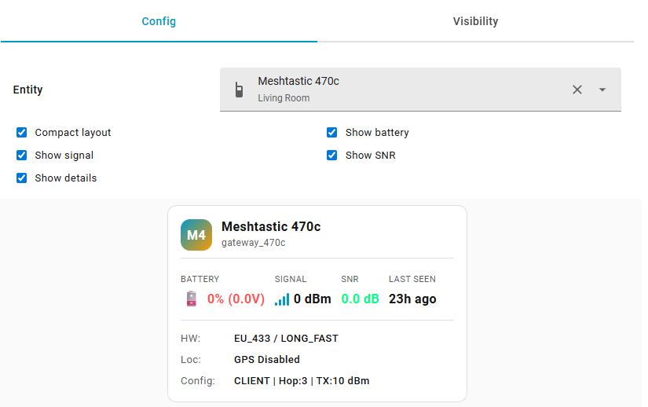

<div align="center">
  
  
  # Meshtastic Node Card for Home Assistant
  
  [](https://github.com/hacs/integration)
  [](https://github.com/T-REX-XP/ha-meshtastic-node-info-custom-card/releases)
  
  A custom card for Home Assistant to display Meshtastic node information with a beautiful, modern UI.
</div>

## Screenshots




*Example of the Meshtastic Node Card displaying node information with battery level, signal strength, and hardware details.*

> 🎉 **New in v2.0.0**: Complete rewrite with customizable layouts and toggleable metrics!
> - **Compact & Full layouts** - Choose the display density that fits your dashboard
> - **Toggleable metrics** - Show/hide battery, signal, SNR, and details sections
> - **Improved configuration** - Visual editor with live preview
> - **Robust error handling** - Better handling of missing entities and invalid data

## Features

- 📱 **Node Information** - Name, ID, and avatar with initials
- 🔋 **Battery Monitoring** - Level with visual indicator and voltage (toggleable)
- 📶 **Signal Strength** - RSSI with visual bars (toggleable)
- 📊 **SNR Display** - Signal-to-Noise Ratio (toggleable)
- ⏰ **Last Seen** - Timestamp with relative time formatting
- 🔧 **Hardware Info** - Model and configuration details (toggleable)
- 📍 **Location Data** - GPS status and availability
- 💬 **Message Statistics** - Total, sent, and received counts
- 🔌 **Gateway Support** - Works with both node sensors and gateway entities
- 🎨 **Theme Integration** - Adapts to Home Assistant themes
- 📐 **Layout Options** - Compact or full display modes
- ⚙️ **Customizable** - Toggle individual metrics on/off
- 🎯 **Live Preview** - See changes in real-time while configuring

## Installation

### HACS Installation (Recommended)

[](https://my.home-assistant.io/redirect/hacs_repository/?owner=T-REX-XP&repository=ha-meshtastic-node-info-custom-card&category=plugin)

**Click the button above** or follow these steps:

1. Open HACS in your Home Assistant instance
2. Click on "Frontend"
3. Click the three dots menu (top right) → Custom repositories
4. Add repository URL: `https://github.com/T-REX-XP/ha-meshtastic-node-info-custom-card`
5. Category: `Lovelace`
6. Click "Add"
7. Find "Meshtastic Node Card" and click "Install"
8. **Important:** Clear your browser cache (Ctrl+Shift+R or Cmd+Shift+R)
9. Restart Home Assistant

**⚠️ Card not appearing?** Clear your browser cache and restart Home Assistant.

#### Post-Installation Checklist

After installing, verify these steps:

- [ ] **Clear browser cache** - Hard refresh with Ctrl+Shift+R (Windows/Linux) or Cmd+Shift+R (Mac)
- [ ] **Restart Home Assistant** - Settings → System → Restart
- [ ] **Check resource is added** - Settings → Dashboards → Resources → Look for `/hacsfiles/ha-meshtastic-node-info-custom-card/meshtastic-node-card.js`
- [ ] **Check browser console** - Press F12, look for errors related to the card
- [ ] **Verify file exists** - Check `/config/www/community/ha-meshtastic-node-info-custom-card/meshtastic-node-card.js`

### Manual Installation

1. Copy `meshtastic-node-card.js` to your Home Assistant `config/www/` directory
2. Add the resource to your dashboard:
   - Go to Settings → Dashboards → Resources
   - Click "Add Resource"
   - URL: `/local/meshtastic-node-card.js`
   - Resource type: `JavaScript Module`
3. Restart Home Assistant (optional but recommended)

## Configuration

### Visual UI Editor (Recommended)

1. Go to your dashboard
2. Click "Edit Dashboard" (top right)
3. Click "+ Add Card"
4. Search for "Meshtastic Node Card"
5. Configure the card:
   - **Entity**: Select your Meshtastic entity (only `meshtastic.*` domain entities shown)
   - **Compact layout**: Toggle for a more condensed display
   - **Show battery**: Display battery level and voltage
   - **Show signal**: Display signal strength with bars
   - **Show SNR**: Display Signal-to-Noise Ratio
   - **Show details**: Display hardware, location, and message counts
6. See live preview on the right as you configure
7. Click "Save"

### Manual YAML Configuration

Add the card to your dashboard with the following configuration:

**Minimal configuration:**
```yaml
type: custom:meshtastic-node-card
entity: meshtastic.gateway_470c
```

**Full configuration with all options:**
```yaml
type: custom:meshtastic-node-card
entity: meshtastic.gateway_470c
compact: false
show_battery: true
show_signal: true
show_snr: true
show_details: true
```

**Compact layout example:**
```yaml
type: custom:meshtastic-node-card
entity: meshtastic.gateway_470c
compact: true
show_details: false
```

### Configuration Options

| Name | Type | Required | Default | Description |
|------|------|----------|---------|-------------|
| `entity` | string | Yes | - | The Meshtastic entity ID (supports `meshtastic.*` domain) |
| `compact` | boolean | No | `false` | Use compact layout (smaller, denser display) |
| `show_battery` | boolean | No | `true` | Show battery level and voltage |
| `show_signal` | boolean | No | `true` | Show signal strength with bars |
| `show_snr` | boolean | No | `true` | Show Signal-to-Noise Ratio |
| `show_details` | boolean | No | `true` | Show hardware, location, and message counts |

## Expected Entity Attributes

The card automatically detects the entity type and adapts the display accordingly.

### For Node Sensors (`sensor.meshtastic_*`)

- `long_name` or `short_name` - Node name
- `node_id` - Node identifier
- `battery_level` - Battery percentage (0-100)
- `voltage` - Battery voltage
- `snr` - Signal-to-Noise Ratio
- `rssi` - Received Signal Strength Indicator
- `last_heard` - Last communication timestamp
- `hardware` - Hardware model
- `location` or `position_precision_bits` - Location information
- `message_count`, `messages_sent`, `messages_received` - Message statistics

### For Gateway Devices (`meshtastic.gateway_*`)

- `friendly_name` - Gateway name
- `device_class: gateway` - Entity type identifier
- `config_lora_region` - LoRa region (e.g., EU_433)
- `config_lora_modemPreset` - Modem preset (e.g., LONG_FAST)
- `config_device_role` - Device role (e.g., CLIENT)
- `config_lora_hopLimit` - Hop limit setting
- `config_lora_txPower` - TX power in dBm
- `config_position_gpsEnabled` - GPS status

## Examples

**Full layout with all metrics (default):**
```yaml
type: custom:meshtastic-node-card
entity: meshtastic.gateway_470c
```

**Compact layout for space-constrained dashboards:**
```yaml
type: custom:meshtastic-node-card
entity: meshtastic.gateway_470c
compact: true
```

**Minimal display - only essential info:**
```yaml
type: custom:meshtastic-node-card
entity: meshtastic.gateway_470c
show_snr: false
show_details: false
```

**Battery-focused display:**
```yaml
type: custom:meshtastic-node-card
entity: meshtastic.gateway_470c
show_signal: false
show_snr: false
show_details: false
```

## Support

For issues or feature requests, please open an issue on GitHub.

## License

MIT License
